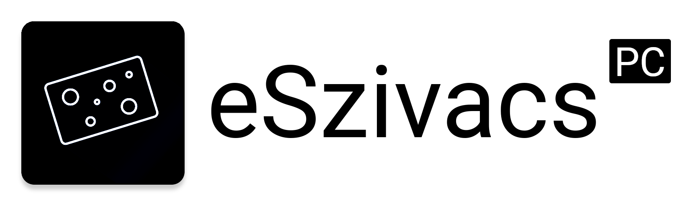

<p align="center"></p>

[<p align="center">](https://travis-ci.org/pepyta/eSzivacs-PC) [](https://github.com/pepyta/eSzivacs-PC/releases) [](https://github.com/pepyta/eSzivacs-PC/releases/latest)</p>

## Tartalom
- [Jellemzők](#jellemzők)
- [Kiadások](#kiadások)
- [Használat](#használat)
- [Harmadik féltől származó szoftverek licenszei](#harmadik-féltől-származó-szoftverek-licenszei)
- [Közreműködők](#közreműködők)
- [Licensz](#licensz)

## Kiadások

| Platform (verzió) | Fájl neve |
| -------- | --------------- |
| Windows x64 (v1.5.0) | [`eSzivacs.exe`](https://github.com/pepyta/eSzivacs-PC/releases/download/v1.5.0/eSzivacs.exe) |
| macOS (v1.5.0) | [`eSzivacs.dmg`](https://github.com/pepyta/eSzivacs-PC/releases/download/v1.5.0/eSzivacs.dmg) |
| Linux (v1.5.0) | [`eSzivacs.AppImage`](https://github.com/pepyta/eSzivacs-PC/releases/download/v1.5.0/eSzivacs.AppImage) |

## Jellemzők
- :electron: Electron alapú felület
- 🗒️ Jegyek lekérdezése
- 🌡️ Hiányzások lekérése
- 📅 Órarend megtekintése

## Használat
<b>Klónozás és modulok telepítése</b>
```
> git clone https://github.com/pepyta/eSzivacs-PC.git
> cd eSzivacs-PC
> npm install
```

<b>Program elindítása</b>
```
> npm start
```

<b>Telepítő létrehozása</b>
```
> npm run dist
```

<b>Egy adott platformra történő telepítő létrehozása</b>

| Platform    | Parancs              |
| ----------- | -------------------- |
| Windows x64 | `npm run dist:win`   |
| macOS       | `npm run dist:mac`   |
| Linux x64   | `npm run dist:linux` |

*macOS platformon hibaüzenetet fog dobni a program indításkor, ha nem írod alá (codesigning) a fájlt, erről részletesebben [itt](https://github.com/electron/electron/issues/7476) olvashatsz.*

## Harmadik féltől származó szoftverek licenszei
- [boapps/e-kreta-hidden-api-docs](https://raw.githubusercontent.com/boapps/e-kreta-api-docs/master/LICENSE)
- [boapps/e-szivacs-2](https://raw.githubusercontent.com/boapps/e-Szivacs-2/master/LICENSE)
- [electron/electron](https://github.com/electron/electron/blob/master/LICENSE)
- [Dogfalo/materialize](https://raw.githubusercontent.com/Dogfalo/materialize/v1-dev/LICENSE)
- [mde/ejs](https://github.com/mde/ejs/blob/master/LICENSE)
- [bowheart/ejs-electron](https://raw.githubusercontent.com/bowheart/ejs-electron/master/LICENSE)
- [jinder/path](https://raw.githubusercontent.com/jinder/path/master/LICENSE)
- [request/request](https://raw.githubusercontent.com/request/request/master/LICENSE)

## Közreműködők
Külön köszönet [boapps](https://github.com/boapps/)-nak, aki létrehozta a [e-kreta-hidden-api-docs](https://github.com/boapps/e-kreta-api-docs)-t!
## Licensz
```
BSD 2-Clause License

Copyright (c) 2019, Gál Péter
All rights reserved.

Redistribution and use in source and binary forms, with or without
modification, are permitted provided that the following conditions are met:

* Redistributions of source code must retain the above copyright notice, this
  list of conditions and the following disclaimer.

* Redistributions in binary form must reproduce the above copyright notice,
  this list of conditions and the following disclaimer in the documentation
  and/or other materials provided with the distribution.

THIS SOFTWARE IS PROVIDED BY THE COPYRIGHT HOLDERS AND CONTRIBUTORS "AS IS"
AND ANY EXPRESS OR IMPLIED WARRANTIES, INCLUDING, BUT NOT LIMITED TO, THE
IMPLIED WARRANTIES OF MERCHANTABILITY AND FITNESS FOR A PARTICULAR PURPOSE ARE
DISCLAIMED. IN NO EVENT SHALL THE COPYRIGHT HOLDER OR CONTRIBUTORS BE LIABLE
FOR ANY DIRECT, INDIRECT, INCIDENTAL, SPECIAL, EXEMPLARY, OR CONSEQUENTIAL
DAMAGES (INCLUDING, BUT NOT LIMITED TO, PROCUREMENT OF SUBSTITUTE GOODS OR
SERVICES; LOSS OF USE, DATA, OR PROFITS; OR BUSINESS INTERRUPTION) HOWEVER
CAUSED AND ON ANY THEORY OF LIABILITY, WHETHER IN CONTRACT, STRICT LIABILITY,
OR TORT (INCLUDING NEGLIGENCE OR OTHERWISE) ARISING IN ANY WAY OUT OF THE USE
OF THIS SOFTWARE, EVEN IF ADVISED OF THE POSSIBILITY OF SUCH DAMAGE.
```
